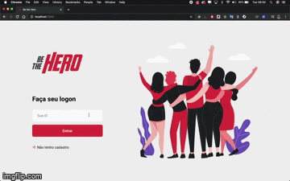
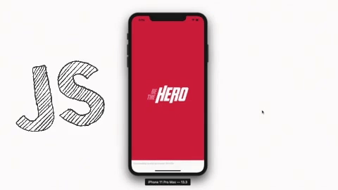

<h1 align="center">
    
</h1>

<h4 align="center">
  🚀 Semana OmniStack 11.0
</h4>

<p align="center">
  

  
</p>

<p align="center">
  <a href="#objetivo">Objetivo</a>&nbsp;&nbsp;&nbsp;|&nbsp;&nbsp;&nbsp;
  <a href="#requerimentos">Requerimentos</a>&nbsp;&nbsp;&nbsp;|&nbsp;&nbsp;&nbsp;
  <a href="#tecnologias-aplicadas">Tecnologias</a>&nbsp;&nbsp;&nbsp;|&nbsp;&nbsp;&nbsp;
  <a href="#-como-executar">:computer: Como Executar</a>&nbsp;&nbsp;&nbsp;
</p>


## Objetivo
Be The Hero é uma aplicação inteiramente feita com javascript do back-end ao front-end e app mobile. O propósito da aplicação é 
aproximar os heróis de diversas causas de ONGs espalhadas mundo a fora.

## Requerimentos

Para conseguir rodar o projeto em sua máquina é necessário ter as seguintes ferramentas instaladas
- NodeJs
- NPM
- Expo

## Tecnologias Aplicadas

- Node.js
- SQLite3
- Knex - ferramenta que ajuda a escrever SQL queries
- Express - framework node.js para facilitar na criação de rotas e APIs
- axios - um cliente HTTP, que funciona tanto no browser quanto em node.js
- nodemon - file watcher
- Celebrate - Express middlewhere para a biblioteca Joi de validação
- Joi - biblioteca de validação de dados JS
- Jest - framewrok de teste
- supertest - biblioteca para testes HTTP node.js
- ReactJS
- React Native ( Expo )

## Demo da Aplicação Web


## Demo da Aplicação Mobile


## :computer: Como Executar

#### Clonando o projeto
```sh
git clone https://github.com/Preddo/be-the-hero.git
cd be-the-hero
```
#### Iniciando Backend
```sh
cd backend
npm install
npm start
```
#### Iniciando Frontend
```sh
cd frontend
npm install
npm start
```
#### Iniciando mobile
```sh
cd mobile
npm install
expo start
```

Feito com ♥ por Pedro Soares 🚀